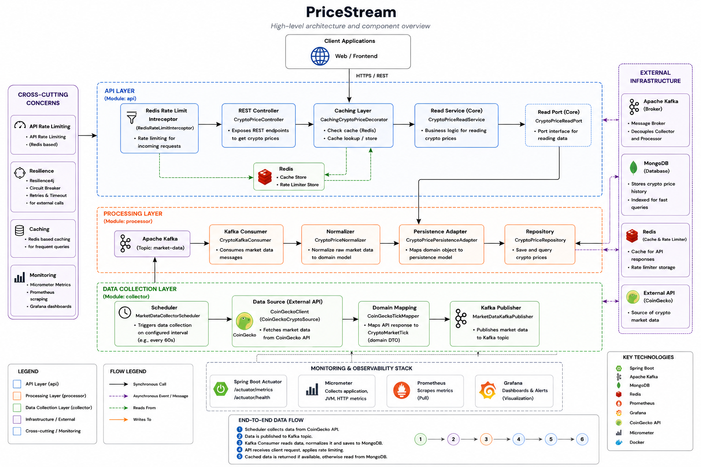

# PriceStream

PriceStream is a market data aggregator that collects real-time cryptocurrency prices from external APIs (such as CoinGecko), processes them asynchronously via Apache Kafka, stores them in MongoDB, and serves them through a high-performance, rate-limited REST API.

## 📑 Table of Contents
- [Architecture Overview](#-architecture-overview)
- [Modules Breakdown](#-modules-breakdown)
- [Testing](#-testing)
- [Technologies Used](#-technologies-used)
- [How to Run](#-how-to-run)
- [Available Services & Endpoints](#-available-services--endpoints)
- [Monitoring Setup](#-monitoring-setup)
- [Key Implementation Decisions](#-key-implementation-decisions)

---

## 🏗 Architecture Overview



PriceStream is built using **Hexagonal Architecture (Ports and Adapters)**. This design strictly separates the core business logic from external frameworks, databases, and messaging systems. The core domain defines interfaces (ports) that are implemented by adapters in the outer layers, ensuring the system is highly testable and loosely coupled.

### Data Flow
1. **Collector** fetches data from CoinGecko on a scheduled basis. It utilizes a **Resilience4j Circuit Breaker** to handle external API failures and throttling gracefully.
2. **Kafka** receives the raw data as asynchronous messages.
3. **Processor** consumes messages, normalizes the data, and persists it to MongoDB.
4. **API** serves the processed data to end-users, caching frequent queries in Redis to minimize database load. It also uses a **Redis Rate Limiter** to protect the endpoints from abuse and traffic spikes.

---

## 📦 Modules Breakdown

The application is structured as a multi-module Maven project:

- **`core`**: The heart of the application containing the domain models and interfaces (Ports). It has no dependencies on Spring or external infrastructure.
- **`collector`**: Responsible for data ingestion. It acts as an adapter to pull data from external sources (CoinGecko) and publish it to the Kafka broker.
- **`processor`**: Consumes messages from Kafka, normalizes the data into the core domain format, and handles persistence to MongoDB.
- **`api`**: The REST interface layer. It handles client requests, delegates caching and rate-limiting to Redis, and queries data from MongoDB via the core ports.
- **`app`**: The bootstrapping module that brings all the components together. It contains the main Spring Boot `Application` class, integration tests, and configuration files.

---

## 🧪 Testing

The project is thoroughly tested with approximately **90% unit test coverage** using JUnit and Mockito.

In addition to unit tests, there are two main **Integration Tests** that verify system components working together:
1. **`PriceStreamIntegrationTest`**: An end-to-end test that verifies the entire data pipeline. It mocks the CoinGecko API response, verifies the message is published to Kafka, consumed by the processor, and finally successfully saved to MongoDB.
2. **`RedisRateLimiterIntegrationTest`**: Verifies the API rate limiting logic by simulating bursts of HTTP requests, ensuring that Redis correctly tracks request counts and the API returns `429 Too Many Requests` when limits are exceeded.

---

## 🛠 Technologies Used

- **Backend:** Java 25, Spring Boot 4.x
- **Messaging:** Apache Kafka
- **Database:** MongoDB
- **Cache & Rate Limiting:** Redis
- **Monitoring:** Prometheus, Grafana, Micrometer
- **Libraries:** Resilience4j, MapStruct, Lombok
- **Build Tool:** Maven

---

## 🚀 How to Run

Running the project is fully containerized and requires only a few simple steps.

1. **Configure Environment Variables:**
   Rename the provided `.env.example` file to `.env`:
   ```bash
   cp .env.example .env
   ```
   Open `.env` and insert your own CoinGecko API key:
   ```properties
   COINGECKO_API_KEY=your_api_key_here
   ```

2. **Start the Application:**
   Run the following command to start all necessary services (Kafka, MongoDB, Redis, Prometheus, Grafana, and the Spring Boot App):
   ```bash
   docker compose up -d
   ```

---

## 🌐 Available Services & Endpoints

Once the containers are up and running, the following services will be available:

- **Main API:** [http://localhost:8080](http://localhost:8080)
- **Actuator Endpoints (Health, Metrics):** [http://localhost:8080/actuator](http://localhost:8080/actuator)
- **Grafana Dashboards:** [http://localhost:3000](http://localhost:3000) *(Default Login: `admin` / Password: `admin`)*

---

## 📊 Monitoring Setup

The project includes a robust monitoring and observability stack out of the box:
- **Micrometer** is integrated into the Spring Boot application to expose JVM, Kafka, and HTTP metrics.
- **Prometheus** scrapes the `/actuator/prometheus` endpoint periodically to collect metrics.
- **Grafana** connects to Prometheus as a data source and provides pre-configured dashboards for visualizing application health, API request rates, and message queue performance.

---

## 💡 Key Implementation Decisions

- **Hexagonal Architecture:** Ensures the domain (`core`) is agnostic of any infrastructure. Swapping out MongoDB for PostgreSQL or Kafka for RabbitMQ only requires changing adapters, not business logic.
- **Asynchronous Data Ingestion:** Decoupling the `collector` from the `processor` using Kafka allows the system to handle API rate limits gracefully and prevents bottlenecks if database writes slow down.
- **Resilience4j:** Integrated to provide circuit breakers and retries when communicating with external APIs (like CoinGecko), ensuring the collector doesn't crash on temporary network issues.
- **Redis Rate Limiting & Caching:** Prevents API abuse and reduces database load. Frequently requested prices are served from memory, significantly decreasing response times.
